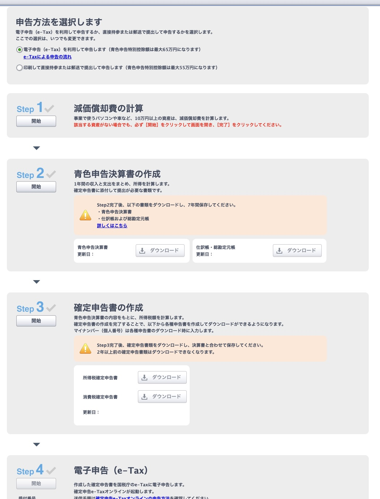
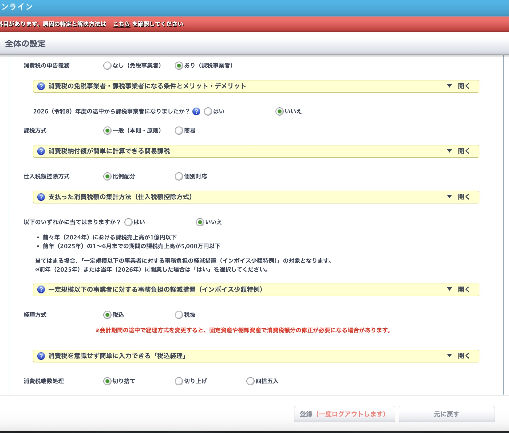
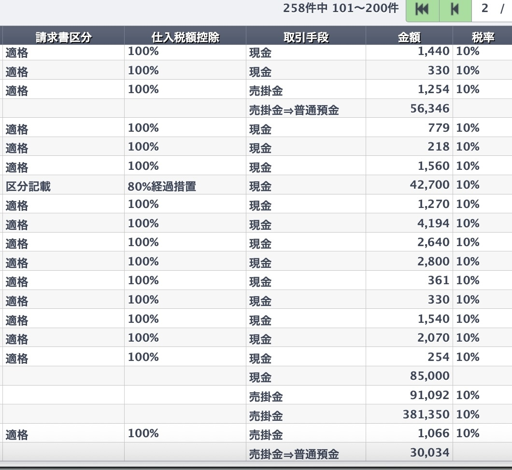

確定申告ソフトを選ぶとき、比較記事を何本読んでも結局どれも同じように見えてくる。自分もそうだった。

20年以上、広告や出版まわりの制作の仕事をフリーランスで続けてきて、青色申告もずっと自分でやってきた。帳簿付けに慣れていないわけでもない。それでもインボイス登録をして消費税の申告が必要になった年、完全に足をすくわれた。

つまずいたのはソフトの操作ではなかった。**消費税の納税額の計算そのものを、根本から勘違いしていた**のだ。

結論から書く。やよいの青色申告オンラインは、いちばん安いセルフプランで足りた。そして自分がつまずいた2つの点は、どちらも同じひとつの誤解から生えていた。同じ場所で転んでいる人はたぶん少なくないので、そこを中心に書く。

## セルフプランで足りる。機能はどのプランも同じだから

先に料金を整理しておく。プランは3つで、いずれも税抜の年額だ(2025年12月の価格改定後)。

- セルフプラン:11,800円
- ベーシックプラン:22,800円
- トータルプラン:39,600円

そして重要なのは、**この3つの差はサポートの有無だけ**という点だ。弥生の公式サイトは、どのプランでも製品機能はすべて使えると明記している。消費税申告、インボイス対応、e-Taxによる申告も含めて全部だ。

ここを誤解させる情報がネット上にある。「セルフプランでは消費税申告書が作れない」と書いている比較サイトを実際に見かけた。自分はセルフプランで消費税の申告まで済ませているので、これは事実と違う。安いプランだと申告できないのではと不安になっている人がいたら、心配しなくていい。

実際、確定申告の画面には所得税確定申告書と並んで消費税確定申告書のダウンロードが用意されている。

セルフプランに付かないのは電話・メール・チャットのサポートだけだ。自分で調べて解決するタイプなら、ここに1万円以上の差額を払う理由はない。逆に、分からないときに人に聞きたい性格なら、ベーシック以上を選んだほうが精神的に安い。

なお、セルフプランとベーシックプランには初年度無償のキャンペーンが継続している。条件と期限は変わるので、申し込む前に公式で確認してほしい。

→ <a href="https://px.a8.net/svt/ejp?a8mat=4B5U4B+AG9Z3M+35XE+5YJRM" rel="nofollow">やよいの青色申告 オンライン(公式サイト)</a>

## 消費税の申告で、自分が完全に勘違いしていたこと

ここが本題だ。

自分はずっと、納める消費税をこう計算するものだと思っていた。

> 売上で受け取った消費税 − 経費や外注で払った消費税 = 納める消費税

だから経費の消費税を積み上げないと納税額が出ないと信じていて、その集計に途方もない手間がかかると身構えていた。

これは**本則課税の計算式**だった。自分が使っていたのは2割特例で、計算はまったく別だった。

> 売上で受け取った消費税 × 20% = 納める消費税

以上である。仕入や経費の消費税は、一切関係しない。売上税額の8割を控除したものとみなす仕組みなので、経費側の実額計算もインボイスの保存も、消費税の計算には不要になる。

たとえば年間の売上が税込880万円なら、売上に含まれる消費税は80万円。納めるのはその20%の16万円。掛け算ひとつで終わる。

ただ、弥生の画面上で2割特例にたどり着くまでには少し迷った。

設定画面(全体の設定)にあるのは、課税事業者かどうか、課税方式が一般(本則)か簡易か、といった帳簿付けのための項目だ。ここに2割特例の選択肢はない。自分はここを何度も見返して、見つからずに焦った。

実際に2割特例を選ぶのは、**確定申告の消費税申告書を作る工程の中**だった。つまり帳簿付けの設定ではなく、申告書を作る最後の段階で出てくる。

同じところで探している人がいたら、設定画面ではなく確定申告の手順を進めていってほしい。自分はここでかなり時間を使った。

選ぶ場所さえ分かってしまえば、あとは選択するだけだ。半年ほど身構えていた計算が、実際には数分で終わった。あのときの気の抜け方は今でも覚えている。

## 外注先のインボイス登録の有無で、悩む必要がなかった

もうひとつ悩んでいたのが、外注しているスタッフのインボイス登録だ。

登録している人と、していない人がいる。請求書の処理をどう分けるべきか、登録していない相手への支払いは自分の納税額をどう押し上げるのか。そこがずっと引っかかっていた。

**答えは、2割特例を使っている年は納税額に影響しない、だった。**

理由はさきほどと同じだ。2割特例は仕入側を計算に入れない。だから外注先が登録していようがいなかろうが、納める消費税は売上税額の20%で変わらない。

つまり前のセクションの勘違いと、この悩みは同じ根から生えていた。本則課税の頭で考えていたから、仕入側が気になって当然だったのだ。

ただし混同しないよう補足しておく。**消費税の計算に影響しないだけで、外注費の請求書が不要になるわけではない。** 所得税の必要経費として落とすには、帳簿と請求書の保存は今までどおり必要になる。「消費税では使わないが、所得税では使う」と分けて考えると整理しやすい。

弥生の取引一覧では、請求書区分が「適格」なら仕入税額控除100%、「区分記載」なら80%経過措置、というように自動で振り分けられる。外注先が登録しているかどうかが、そのまま帳簿に反映される仕組みだ。

記帳としては正しく残るが、2割特例を適用する年は、この数字が納税額を動かすことはない。
## 申告書は、表示されたステップを順番に埋めるだけだった

計算の仕組みが分かってしまえば、申告書の作成は拍子抜けするほど単純だった。

まず電子申告(e-Tax)か、印刷して提出かを選ぶ。あとはStep1の減価償却費の計算から、Step2の青色申告決算書、Step3の確定申告書、Step4の電子申告まで、上から順に進めるだけだ。どの数字をどの欄に書くのかを自分で判断する場面がない。税務署の書式と向き合った経験がある人ほど、この差はありがたく感じるはずだ。

e-Taxでの送信もそのまま画面から進められる。印刷して持っていく必要はなかった。

なお、青色申告特別控除は電子申告なら最大65万円、印刷して提出する場合は最大55万円になる。最初の選択画面でここも決まるので、意識しておきたい。

## 2割特例が使えるのは2026年分まで

これは今年に限った話なので書いておきたい。

2割特例は個人事業主の場合、**2026年分の確定申告(2027年3月提出)が最後**になる。適用期間が令和8年9月30日までの日を含む課税期間と決まっているためだ。

その後は令和8年度税制改正で新設された「3割特例」に移る。個人事業主に限り、2027年分と2028年分は納付税額を売上税額の30%とできる。計算の簡単さは残るが、負担は上がる。

さらに、免税事業者からの仕入について控除できる割合も、2026年9月末で80%が終わる。以前は10月から一気に50%になる予定だったが、令和8年度税制改正で段階が細かくなり、2026年10月からは70%となることが決まった。外注を使っている側としては、こちらも意識しておきたいところだ。

制度の細かい要件は国税庁のサイトで確認してほしい。自分は税理士ではないので、ここに書いたのはあくまで自分の申告での経験だ。ただ、**2割特例で申告できる最後の年に立っている**という事実は、今のうちに知っておいて損はない。

## 向いている人、向いていない人

2年使った上での正直な評価を書く。

**向いている**

- 自分で調べて解決するタイプの人
- コストを最優先したい人(セルフプランなら年11,800円)
- 帳簿付けの経験があり、操作サポートを必要としない人
- Macを使っている人(デスクトップ版はWindows専用なので、実質オンライン版一択になる)

**向いていない**

- 分からないときに人に聞きたい人(ベーシック以上を選ぶべき)
- 画面のデザインや操作の気持ちよさを重視する人。他社のほうが洗練されている
- 見積書や請求書の作成まで1つで済ませたい人。これは別料金になる

2年目以降は通常料金に戻るので、初年度無償だけを見て決めないほうがいい。それでもセルフプランの年11,800円は、この種のソフトとしては安いほうだ。

最新のプラン内容とキャンペーン条件は公式で確認できる。

→ <a href="https://px.a8.net/svt/ejp?a8mat=4B5U4B+AG9Z3M+35XE+5YJRM" rel="nofollow">やよいの青色申告 オンラインの料金プランを確認する</a>

## まとめ

振り返って思うのは、ソフト選びで悩んでいた時間より、**制度を勘違いしていた時間のほうが長かった**ということだ。

やよいの青色申告オンラインは、消費税の申告を含めてセルフプランで完結した。サポートを使わないなら、上位プランを選ぶ理由は見つからなかった。

もし今年が初めての消費税申告なら、まず自分がどの計算方法を使うのかを確かめるところから始めてほしい。そこがずれていると、ソフトをいくら操作しても答えは出ない。自分がそうだった。

初年度無償の期間に実際の取引を入れてみるのが、いちばん確実な判断方法だと思う。合わなければ翌年に変えればいい。

→ <a href="https://px.a8.net/svt/ejp?a8mat=4B5U4B+AG9Z3M+35XE+5YJRM" rel="nofollow">やよいの青色申告 オンラインを見てみる(公式サイト)</a>

<!--
公開前チェック(残り)
1. images/ に4枚が入っているか(cover.jpg / zeiritsu.jpeg / kakutei-shinkoku-step.jpg / shouhizei-settei.jpg)
2. cover.jpg を長辺1600px程度に縮小(元は4898px)
3. npm run dev で画像が表示されるか確認
4. 公開後、Search Consoleでインデックス登録をリクエスト
5. No.5「消費税の2割特例を実際にやってみた」公開後に内部リンクを追加
-->